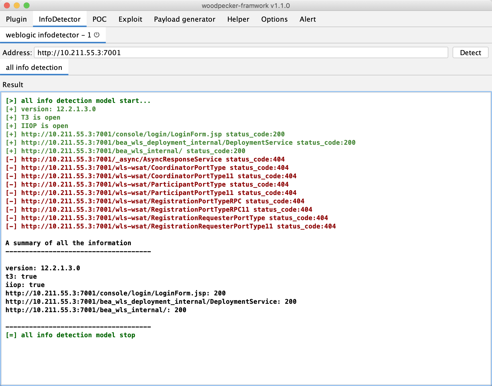

## Weblogic信息探测插件
- [x] 探测版本
- [x] 探测t3协议是否开启
- [x] 探测iiop协议是否开启
- [x] 探测console是否存在
- [x] 探测async组件是否存在
- [x] 探测wls-wsat组件是否存在
- [x] 探测bea_wls_internal组件是否存在
- [x] 探测bea_wls_deployment_internal组件是否存在

